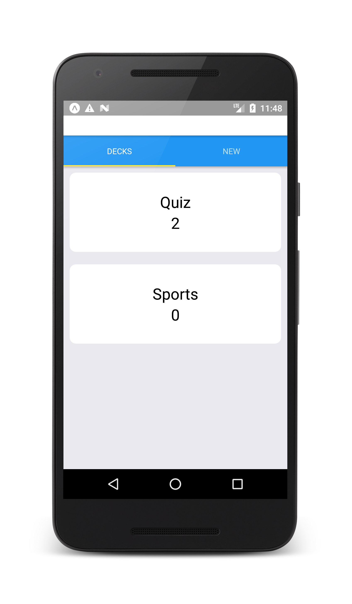
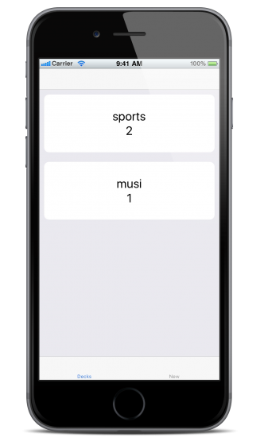
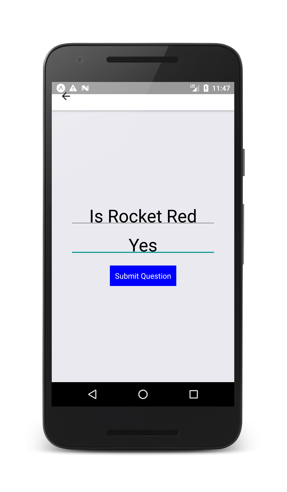
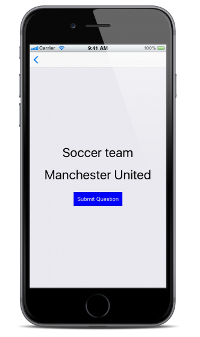
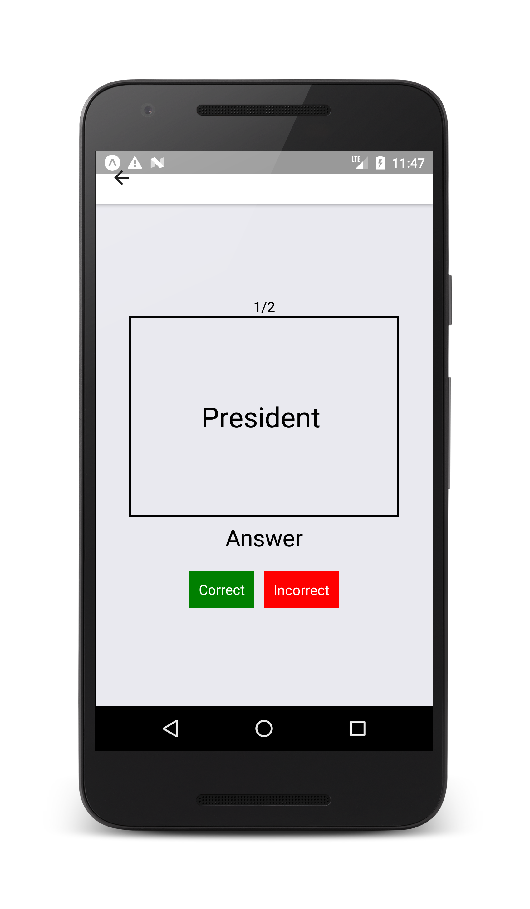
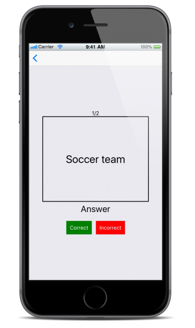
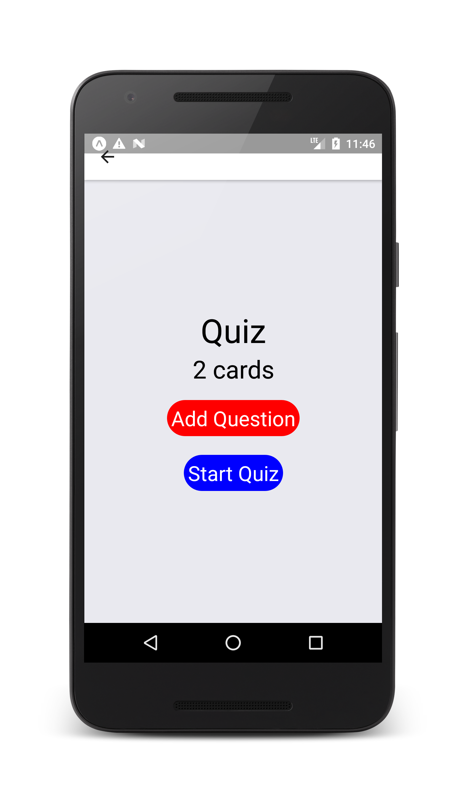
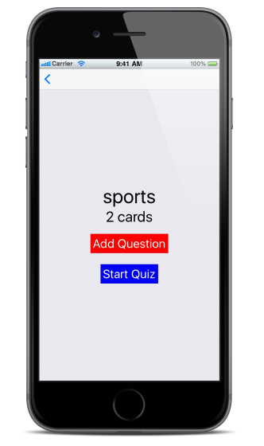
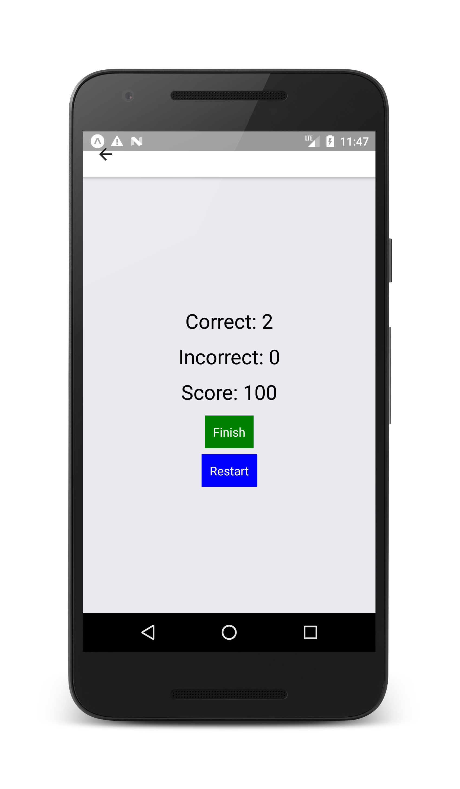
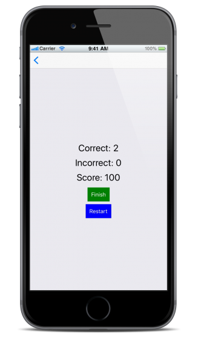

# Mobile FlashCards
This project was bootstrapped with [Create React Native App](https://github.com/react-community/create-react-native-app).

## Description 
This Mobile FlashCards app is a self learnning app that allow user to ask question by themselves through app. The app will allow users to create different categories of flashcards called "decks", add flashcards to those decks, then take quizzes on those decks.

## Prerequisite
* expo
* android emulator or android device

## Usage
* Download app `git clone git@github.com:xiaobo1992/mobile-flashcard.git` 
* Install depedencies `npm install`
* Run app `npm start` or `npm run android`
* press `a` to run on android emulator and android device

## Screenshot

